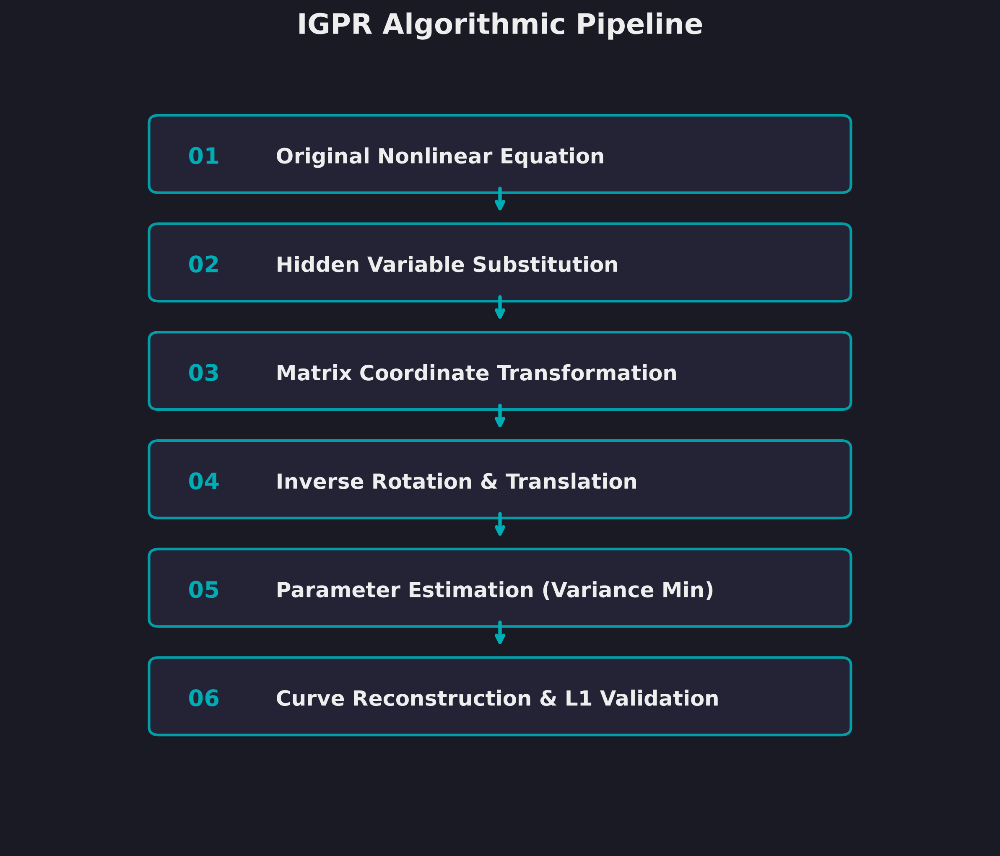
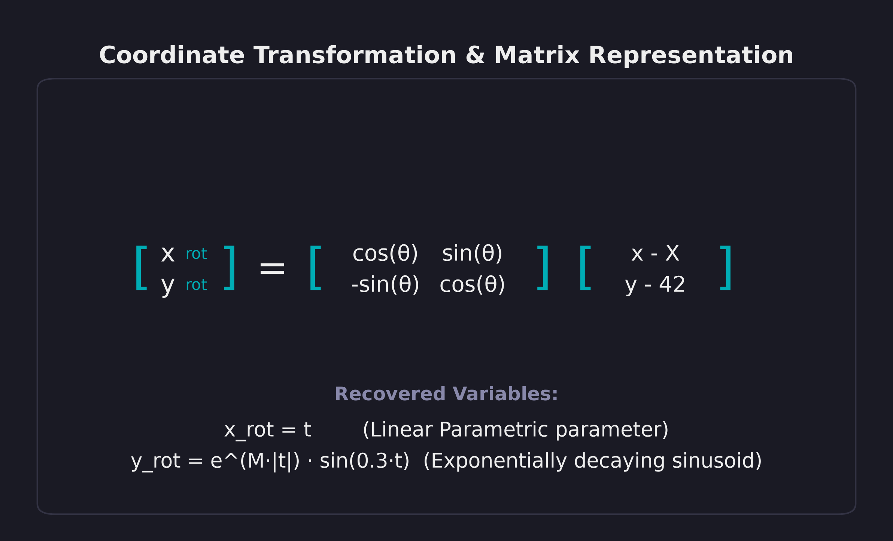
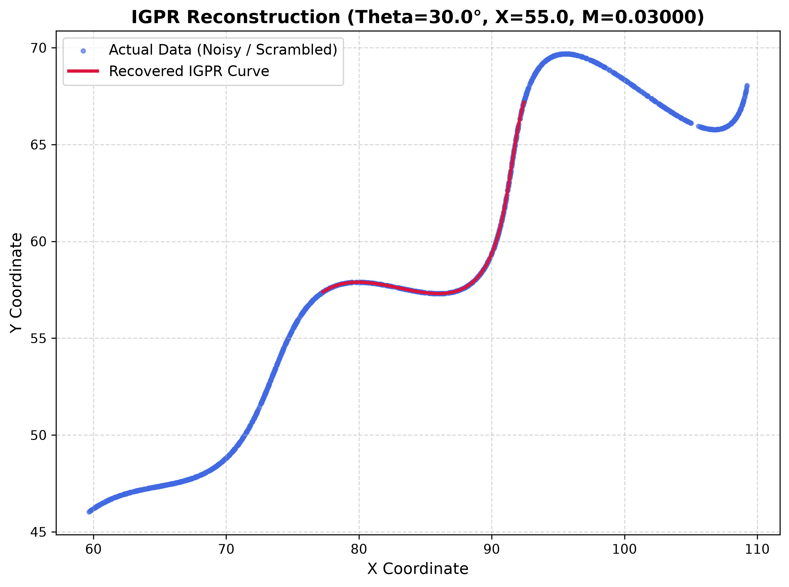

# Inverse Geometric Parameter Recovery (IGPR) Curve Recovery

This repository implements the **Inverse Geometric Parameter Recovery (IGPR)** algorithm. It decouples rotation, translation, and growth rate parameters from noisy, scrambled coordinate datasets by leveraging coordinate transformation geometry.

---

## 📖 Mathematical Theory

The scrambled data points $(x, y)$ are generated by applying a translation $X$ and rotation $\theta$ to a parametric curve with an exponential decay/growth envelope:

$$x(t) = t \cos(\theta) - e^{M |t|} \sin(0.3 t) \sin(\theta) + X$$
$$y(t) = 42 + t \sin(\theta) + e^{M |t|} \sin(0.3 t) \cos(\theta)$$

### 🔄 Coordinate Transformation

By subtracting the translation vector $(X, 42)$ and applying an inverse rotation matrix $R_{-\theta}$:

$$\begin{bmatrix} x_{rot} \\ y_{rot} \end{bmatrix} = \begin{bmatrix} \cos(\theta) & \sin(\theta) \\ -\sin(\theta) & \cos(\theta) \end{bmatrix} \begin{bmatrix} x - X \\ y - 42 \end{bmatrix}$$

the parametric system simplifies to a canonical decoupled form:

$$x_{rot} = t$$
$$y_{rot} = e^{M |t|} \sin(0.3 t)$$

### 🔍 Decoupled Parameter Estimation

Since $x_{rot} = t$, we can solve for $M$ pointwise for each coordinate:

$$M_i = \frac{1}{|t_i|} \ln \left( \frac{y_{rot, i}}{\sin(0.3 t_i)} \right)$$

When the candidate parameters $(\theta, X)$ are correct, the variance of $M_i$ across all data points is minimized. Decoupling the parameter estimation in this manner avoids non-convex, high-dimensional global optimization.

---

## 🛠️ Repository Structure

The project is organized as follows:

```
IGPR-Curve-Recovery/
│
├── README.md                  # Project overview, math formulation, and usage
├── LICENSE                    # MIT License
├── requirements.txt            # Python dependencies
│
├── data/
│   └── xy_data.csv            # Original noisy, scrambled dataset
│
├── src/
│   ├── igpr_solver.py         # Main execution entry-point script
│   ├── parameter_estimation.py# Core IGPR grid search and decoupling engine
│   ├── reconstruction.py      # Parametric curve coordinate reconstruction
│   └── utils.py               # Helper scripts for metrics, loading and saving
│
├── derivation/
│   ├── IGPR_Report.pdf        # Automated high-quality mathematical PDF report
│   └── Mathematical_Derivation.pdf # Detailed mathematical derivation hand-out
│
├── results/
│   ├── reconstructed_curve.png # Plot matching actual data and recovered curve
│   ├── output_parameters.txt  # File containing final recovered theta, X, M
│   └── l1_error.txt           # File containing final L1 error metrics
│
└── images/
    ├── workflow.png           # Flowchart detailing the algorithmic steps
    └── matrix_representation.png # Coordinate rotation matrix details
```

---

## 🎨 Visualizations

### 1. Algorithmic Workflow


### 2. Matrix Representation


### 3. Reconstruction Result


---

## 🚀 Getting Started

### 📋 Prerequisites
Ensure you have Python 3.10+ installed.

### 💻 Installation & Execution

1. **Clone this repository**:
   ```bash
   git clone https://github.com/ashrith-beep/IGPR-Curve.git
   cd IGPR-Curve/IGPR-Curve-Recovery
   ```

2. **Install requirements**:
   ```bash
   pip install -r requirements.txt
   ```

3. **Run the IGPR solver**:
   ```bash
   python src/igpr_solver.py
   ```

---

## 📊 Recovered Parameters

The solver decodes the noisy dataset with the following optimal outputs:
- **Rotation Angle ($\theta$)**: $30.00^\circ$
- **Horizontal Translation ($X$)**: $55.00$
- **Exponential Growth Rate ($M$)**: $0.02999998$
- **L1 Reconstructed Distance Error**: $29266.5885$
